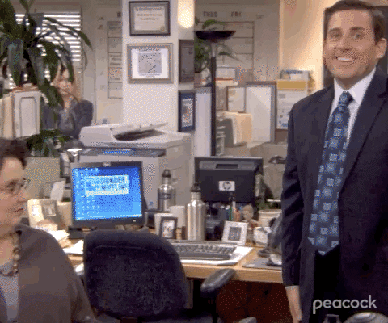

<h3 style="background-color:bisque;text-align:center;font-size:150%;">[Home](https://pbischoff3.github.io/) | [Data Overview](https://pbischoff3.github.io/data_overview/) | [Multi-Dimensional Analysis](https://pbischoff3.github.io/multi_dimensional_analysis/) | [Models](https://pbischoff3.github.io/models/) | [Conclusion](https://pbischoff3.github.io/Conclusion/)</h3>

## What did we do?
In this project, we first cleaned the data into a format that we could accurately use in R. After that, we ran multi-dimensional analysis. This let us see if there were significant differences in the demographics in the way they answered the questions. We took this data, and we ran this back into a model. This gave us the ability to see how specifically the demographics affected the answers to the question.

## What did we learn?
First off, we learned how to do an MDS, which was pretty cool stuff that I wouldn't have learned outside of this project. The MDS is common in ecological data, but it totally applies to survey data analysis. Also, we learned valuable insights we can apply to our research project.

## Why does this matter?
Ultimately, it gave me a good chance to spend a lot of time in R, becoming more comfortable. Also, this will be useful in my research project. All in all, the skills learned in R is why this matters the most. 

## Conclusion
Thank you for attending my Ted Talk.  

