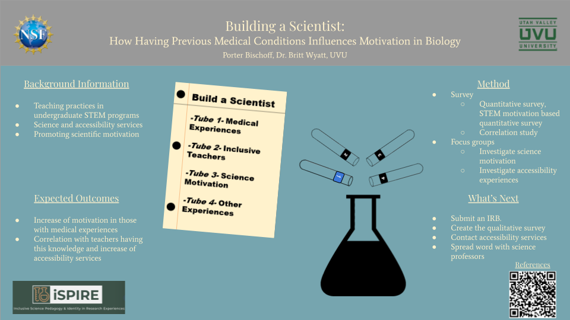

<body style="background-color:MintCream;">

<h3 style="text-align:center;font-size:185%;">[Home](https://pbischoff3.github.io/)  |  [Conferences](https://pbischoff3.github.io/Conferences) | [R Projects](https://pbischoff3.github.io/Projects)   |   [Publications](https://pbischoff3.github.io/Publications)  |  [Medical Hours](https://pbischoff3.github.io/Hours)</h3>

<h4 style="text-align:center;font-size:150%;"> [2022](https://pbischoff3.github.io/Conferences/2022)  |  [2021](https://pbischoff3.github.io/Conferences/2021)  |  [2020](https://pbischoff3.github.io/Conferences/2020) </h4>

2020 was the year I began doing research at my university. It was this year that I was granted the [NSF S-STEM scholarship](https://www.uvu.edu/biology/s_stem_scholarship.html) that has given me the opportunity to devote so much time to something I am so passionate in studying. 
   

## S-STEM Presentation - December 2020
 
With Fall 2020 being the first semester I was involved with this program, we had an Introduction to Research class that we attended, allowing us to rotate through the labs of those professors on our campus. I was intrigued with the research of Dr. Britt Wyatt, and we decided to work together for the future. As part of this class, one assignment was to create a plan for a project that we would present to our fellow cohort and faculty. Attached is the presentation that I created for that small conference.

<a href="photos/SSTEM presentation.png" download>Click to Download</a>