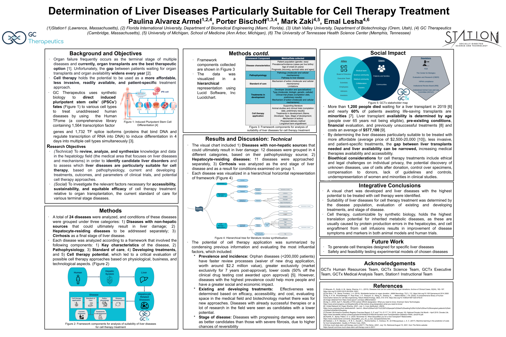

<body style="background-color:Gainsboro;">

<h3 style="background-color:DarkSeaGreen;text-align:center;font-size:175%;">[Home](https://pbischoff3.github.io/)   |   [Research]((https://pbischoff3.github.io/Research))   |   [Conferences](https://pbischoff3.github.io/Conferences) | [Projects](https://pbischoff3.github.io/Projects)   |   [Publications](https://pbischoff3.github.io/Publications)</h3>

<h4 style="background-color:DarkSeaGreen;text-align:center;font-size:150%;"> [2020](https://pbischoff3.github.io/Conferences/2020)  |  [2021](https://pbischoff3.github.io/Conferences/2021)  |  [2022](https://pbischoff3.github.io/Conferences/2022) </h4>

In 2021, we worked on getting IRB approval for my project at UVU. Eventually, we were granted that approval in getting UVU IRB #936. The rest of the year was spent in data collection, preparing for eventual presentation on what we had discovered. 
 
In the meantime, I worked on another side project regarding how Covid influenced First Generation Student's experiences in science. This presentation was presented on in January of 2022. 
  

## Station1 Closing Conference - August 2021
In 2021, I was also given the opportunity to be a part of the [Station1 Frontiers Fellowship](https://www.station1.org/sff). At the end of this marvelous experience, we presented on what we had learned in studying stem cell therapies for the curing of incurable diseases. See the presentation below. 

<a href="photos/Poster.pptx.png" download>Click to Download</a>
