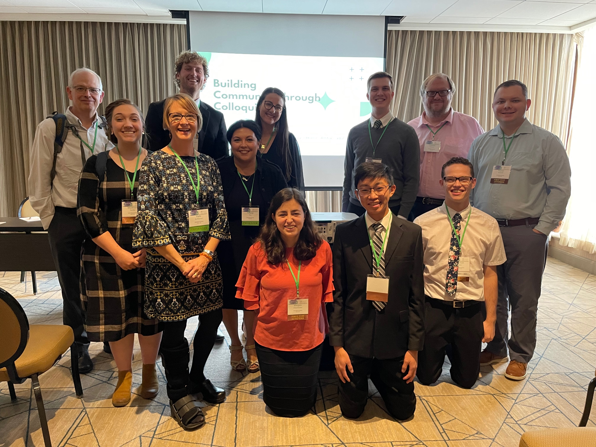

<body style="background-color:MintCream;">

<h3 style="text-align:center;font-size:185%;">[Home](https://pbischoff3.github.io/)  |  [Conferences](https://pbischoff3.github.io/Conferences) | [R Projects](https://pbischoff3.github.io/Projects)   |   [Publications](https://pbischoff3.github.io/Publications)  |  [Medical Hours](https://pbischoff3.github.io/Hours)</h3>

<h4 style="text-align:center;font-size:150%;"> [2022](https://pbischoff3.github.io/Conferences/2022)  |  [2021](https://pbischoff3.github.io/Conferences/2021)  |  [2020](https://pbischoff3.github.io/Conferences/2020) </h4>

2022 was my first real opportunity to present on what I had been learning. The Covid project came to a head where we could present at both UCUR and the UVU Showcase, while initial results from the Medical Conditions project was presented on at ASMCUE. 
<br>

## Utah Council of Undergraduate Research ([UCUR](https://www.ucur.org/)) - February 2022

This presentation took place virtually in tandem with the undergraduate schools in Utah, being hosted by Dixie State University. 

<br>

<center>
```{r echo=FALSE}
library(vembedr)
embed_url("https://www.youtube.com/watch?v=ljhjICzPYfw")
```
</center>

<br>

### Abstract 
First-generation students (FGSs) are less likely to earn a four-year degree than their continuing generation peers (CGSs). This trend is particularly pronounced in STEM disciplines. FGSs are more likely to be communally oriented which contrasts the typical values of universities that value individual accomplishments. This generates a disconnect between FGS’s values and the perceived values of STEM. However, limited data is available from teaching institutions that are open-enrollment. In addition, few studies have examined peer interactions as a specific source of science motivation and communal views of science. This study examined student’s cooperative experiences with peers and STEM motivation through pre/post-test survey collection within STEM classes. Students were asked questions addressing STEM motivation, the value of working with others and their community, and the community orientation of STEM disciplines. Early results show that FGS do indeed rely on cooperative experiences with peers to judge the communal orientation of science which then impacts their science motivation. We predict that similar trends will be seen for women and that these trends will be significantly weaker for CGSs. Our next steps include continuing with the data analysis. Also, this survey was taken when COVID-19 caused an emergency transition to online learning. Future data collection will provide a comparison to better understand the impacts of the emergency transition on STEM students. 

<br> 

## [UVU Showcase](https://www.uvu.edu/sculpt/events/showcase.html) - April 2022

Similar to UCUR, I was able to present on my Covid project, but this time, presenting in person was a wonderful experience for me. <br>

<center>


</center>
<a href="photos/Poster Draft 6-1.png" download>Click to Download</a>
<br>

## American Society for Microbiology Conference for Undergraduate Educators ([ASMCUE](https://asm.org/Events/ASM-Conference-for-Undergraduate-Educators/Home)) - July 2022
This was my first opportunity to present on the Medical Conditions project. This was a great opportunity for me, as I was one of only a few undergraduates who presented at this conference. 

<center>
```{r echo=FALSE}
library(vembedr)
embed_url("https://www.youtube.com/watch?v=uUSxcEBUV24")
```
</center>
<a href="files/Bischoff ASMCUE presentation" download>Click to Download</a>
<br>

### Abstract
Understanding different aspects of science motivation allows educators to appropriately tailor their pedagogy and increase student success in the science fields. Aspects of science motivation that have been explored in the past include: perceived self-efficacy, career motivation, intrinsic motivation, self-determination, and grade motivation. These factors are foundational in Self Determination Theory (Deci, 2012), which explores the importance of autonomy, competence, and relatedness in identifying self-determination. One aspect that may influence self-determination for science motivation could be the presence of medical experiences in the life of the student (having a medical experience/condition or being a caregiver for one who has medical conditions). Based on the Self-Determination Theory, we hypothesized that self-determination and intrinsic motivation would be increased if a student identified as having a medical experience(s).  Based on data analysis from surveys given to different introductory biology classes, aspects influenced by the Self-Determination Theory were explored as well as if one has a medical experience/condition or cares for one who does. Results show that students with medical conditions had significantly higher science motivation overall (d = .37. medium effect), particularly for intrinsic motivation (d = .50. medium effect). These results suggest that those with medical conditions enjoy learning science and understand the importance of science in one’s daily life more than those who do not. In addition, students with medical experiences had significantly higher science identities (d= .38). This suggests that those with medical conditions see themselves as science people and scientists. Further analysis will be run through focus groups to allow us to better understand individual experiences surrounding the connection of medical conditions in science motivation. This study will provide insight into understanding the influence of medical conditions on science motivation and thus allow educators, doctors, parents, and others help encourage science experiences in those that have medical experiences. 

<br>

## National Collegiate Honors Council ([NCHC](https://www.nchchonors.org/)) - November 2022

I had the wonderful opportunity to represent the UVU Honor's Program at the NCHC Conference in Dallas, TX. We were able to share with other honors programs the fantastic things that are happening at UVU. This truly opened my eyes to how lucky I am to have attended this university. UVU has been the best university and has given me the most tools to succeed than I could have imagined. 

</center>
<a href="photos/Bischoff NCHC 2022 Utah Valley University" download>Click to Download</a>
<br>

### Abstract 
Signature experiences are a key element that sets honors education apart from standard collegiate offerings. They are a primary reason students apply for and remain in honors At Utah Valley University's honors program, we offer the repeated signature experience of semester long, experiential learning, one-credit class called Honors Colloquium and Housing Colloquium. This experience is key for building community on our commuter campus, which has a small residential component via a public-private partnership. This session will involve  facilitation by honors faculty, staff, and student leaders. Our session, which would be ideally suited for attendees  from commuter/urban/non-residential campuses will offer a warm-up activity that gets tables reflecting on barriers to student community on their campus. The takeaways for the workshop will include structured brainstorms of community-building activities that are both free and that will require funding, as well as marketing ideas for communicating the colloquia to students. Plans for requesting or obtaining funding will be offered to participants. The honors director and assistant director at Utah Valley University, assisted by up to eight of our student ambassadors, will facilitate a roundtable discussion of specific methods and specific activities that help connect honors students to each other based on our decade-long successful program.
