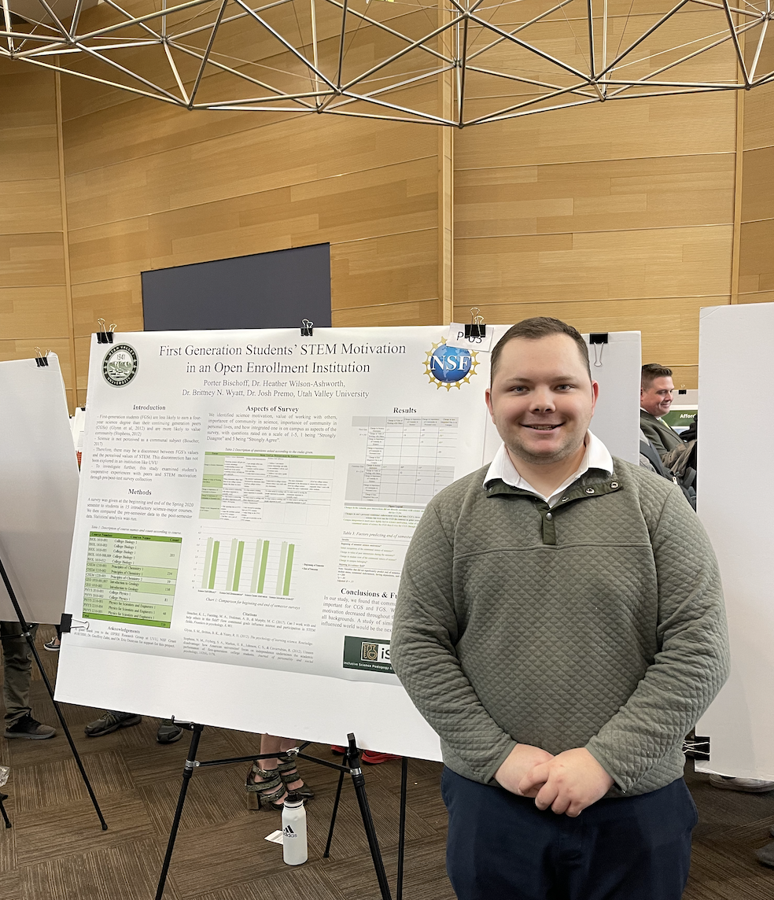

<body style="background-color:MintCream;">

<h3 style="text-align:center;font-size:185%;">[Home](https://pbischoff3.github.io/)  |  [Conferences](https://pbischoff3.github.io/Conferences) | [R Projects](https://pbischoff3.github.io/Projects)   |   [Publications](https://pbischoff3.github.io/Publications)  |  [Medical Hours](https://pbischoff3.github.io/Hours)</h3>

<h4 style="text-align:center;font-size:150%;"> [2022](https://pbischoff3.github.io/Conferences/2022)  |  [2021](https://pbischoff3.github.io/Conferences/2021)  |  [2020](https://pbischoff3.github.io/Conferences/2020) </h4>

I am excited for the opportunities to share what I have been researching with others. I hope that as I continue finding new breakthroughs that I will be able to continue sharing these things in conferences. 

