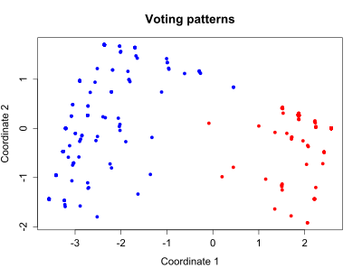
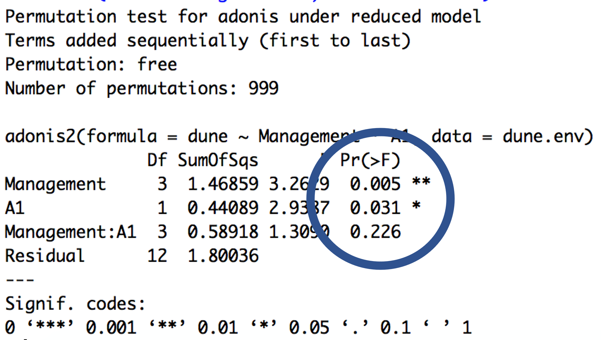

<h3 style="background-color:bisque;text-align:center;font-size:150%;">[Home](https://pbischoff3.github.io/Projects/BIOL_3100) | [Data Overview](https://pbischoff3.github.io/Projects/BIOL_3100/data_overview/) | [Multi-Dimensional Analysis](https://pbischoff3.github.io/Projects/BIOL_3100/multi_dimensional_analysis/) | [Models](https://pbischoff3.github.io/Projects/BIOL_3100/models/) | [Conclusion](https://pbischoff3.github.io/Projects/BIOL_3100/Conclusion/)</h3>

<h4 style="background-color:bisque;text-align:center;font-size:95%;">[Major](https://pbischoff3.github.io/Projects/BIOL_3100/multi_dimensional_analysis/Major/) | [Gender](https://pbischoff3.github.io/Projects/BIOL_3100/multi_dimensional_analysis/Gender/) | [Career](https://pbischoff3.github.io/Projects/BIOL_3100/multi_dimensional_analysis/career/) | [Ethnicity](https://pbischoff3.github.io/Projects/BIOL_3100/multi_dimensional_analysis/Ethnicity/) | [First Generation Students](https://pbischoff3.github.io/Projects/BIOL_3100/multi_dimensional_analysis/fgs/) | [Dependents](https://pbischoff3.github.io/Projects/BIOL_3100/multi_dimensional_analysis/dependents/)      | [Medical Condition](https://pbischoff3.github.io/Projects/BIOL_3100/multi_dimensional_analysis/medical_condition/) | [Medical Care](https://pbischoff3.github.io/Projects/BIOL_3100/multi_dimensional_analysis/medical_care/) | [Analysis](https://pbischoff3.github.io/Projects/BIOL_3100/multi_dimensional_analysis/analysis/)</h4>

```{r setup, include=FALSE}
knitr::opts_chunk$set(echo = TRUE)
```

## **What is MDS?**
  As we are towards the beginning of data analysis, I wanted to use this project as an opportunity to view the data in an abstract way that we would not typically explore in our lab group. Therefore, multidimensional scaling is what we decided to use. 
  <br>
    
Multidimensional scaling is a way to measure similarity of individual cases in our data set. So, in English, this means that we are exploring the grouping of student responses according to different demographics. For example, we looked into different groupings in the ways that students responded to questions regarding science identity and compared them back to gender, for example. This allowed us to visualize what the differences in all 5 questions of science identity for each respondent were. 
  
### **Example**
An example of MDS is shown below, exploring voting patterns in the House of Representatives. 
  

<br>

As you can see, the values on the x-axis and y-axis are arbitrary according to the type of MDS that is run. This serves us no purpose in analyzing the actual data, but it does give us a starting point for comparing the types of responses. Each dot on the chart is an individual voter, the color is according to political orientation, and the location of the dot shows how specifically the individual voted. Knowing this, we are able to see a significant difference in Democrat and Republican voting patterns. This can be confirmed through further statistical analysis.
<br>
    
*All of this was done with the "vegan" package in R.*
    
## **Adonis Test**
To confirm or deny the significance of the differences in types of answers, we ran a permutational multivariate analysis of variance using distance matrices. That all means absolutely nothing to me personally. In English, it compares the "groupings" that we found against each other to see if they were significantly different. 

### **Example**
An example is shown below:
    

  <br> 

Now, this is a little confusing in and of itself, but the most important part of the "adonis" test is the blue circle on the picture. What this shows us is if there is a difference in the groupings of the responses, according to parameters that we give. A practical example of this in my project would be in the science identity questions, there is or is not a significant difference in how different genders respond to the survey.
<br><br>

## **Significance Coding**
From here on out, to make our output easier to take track of, those adonis results that *are significant* will have this image to denote them:
<br>


<br>
On the other hand, those adonis results that *are not significant* will have this image to denote them:


    
Now that all of this is taken care of, lets dive into our actual data and see what we can learn.

<h3 style="text-align:right;font-size:180%;">[**NEXT**](https://pbischoff3.github.io/Projects/BIOL_3100/multi_dimensional_analysis/Major/)
