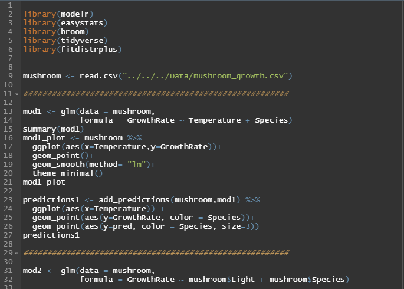

<body style="background-color:MintCream;">

<h3 style="text-align:center;font-size:185%;">[Home](https://pbischoff3.github.io/)  |  [Conferences](https://pbischoff3.github.io/Conferences) | [R Projects](https://pbischoff3.github.io/Projects)   |   [Publications](https://pbischoff3.github.io/Publications)  |  [Medical Hours](https://pbischoff3.github.io/Hours)</h3>

<h4 style="text-align:center;font-size:150%;">[MD PhD](https://pbischoff3.github.io/Projects/MD_PhD) | [BIOL 3100 Final](https://pbischoff3.github.io/Projects/BIOL_3100) | [SPUR Preparation](https://pbischoff3.github.io/Projects/SPUR_Prep) </h4>

## Description

Following the links under the associated tabs, see different R projects I have been involved in, either in classes or on my own.

