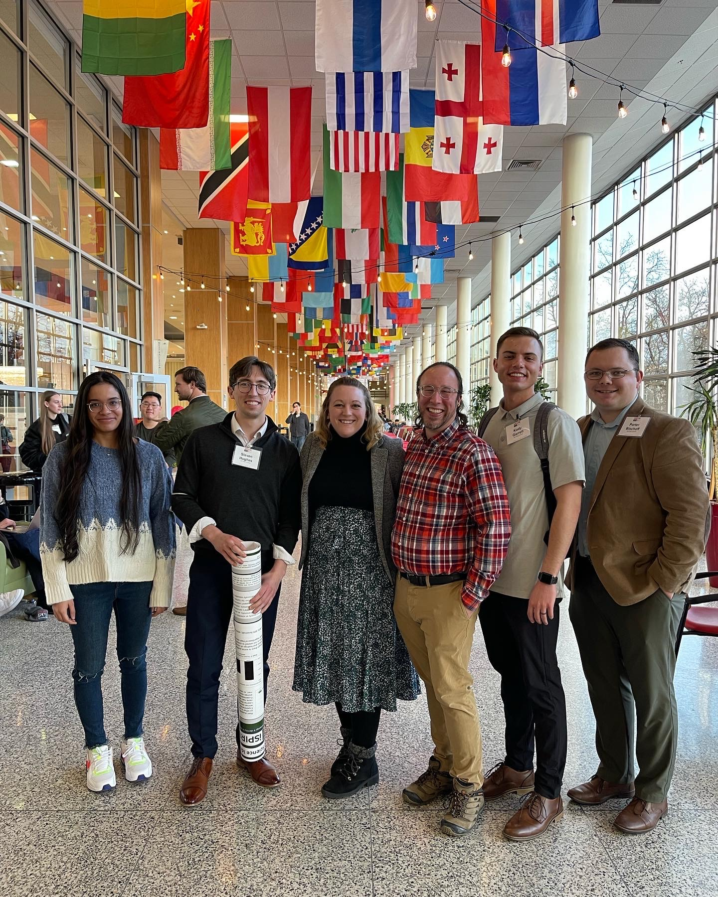
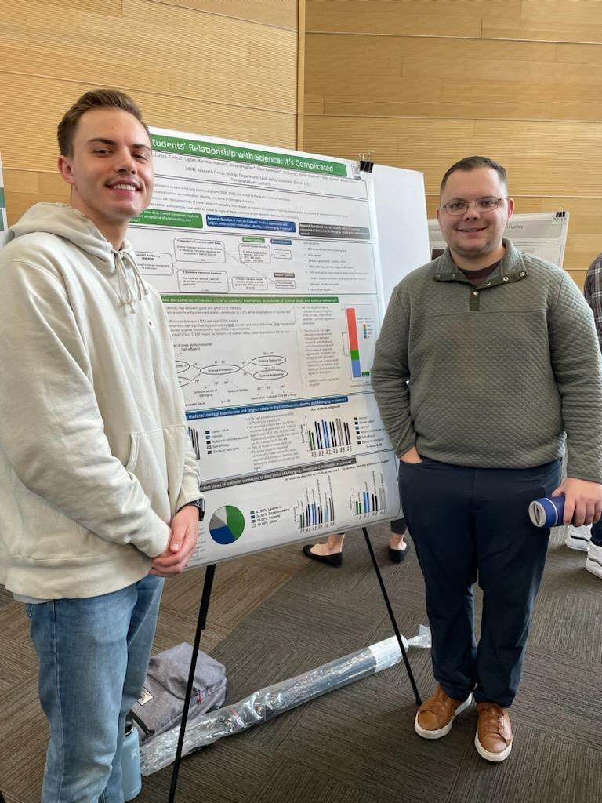

<body style="background-color:MintCream;">

<h3 style="text-align:center;font-size:185%;">[Home](https://pbischoff3.github.io/)  |  [Conferences](https://pbischoff3.github.io/Conferences) | [R Projects](https://pbischoff3.github.io/Projects)   |   [Publications](https://pbischoff3.github.io/Publications)  |  [Medical Hours](https://pbischoff3.github.io/Hours)</h3>

<h4 style="text-align:center;font-size:150%;">
[2023](https://pbischoff3.github.io/Conferences/2023) | [2022](https://pbischoff3.github.io/Conferences/2022)  |  [2021](https://pbischoff3.github.io/Conferences/2021)  |  [2020](https://pbischoff3.github.io/Conferences/2020) </h4>

In 2023, I feel like I really got my feet underneath me in research. The computational skills I had gained allowed me to really flourish in presenting my research. These experiences further solidified the idea that I need to include research in my future, as it is one of the areas in which I feel my creativity can really poke through. 

## Utah Council of Undergraduate Research ([UCUR](https://our.utah.edu/education-events/ucur/)) - February 2023
This presentation took place in a venue for different undergraduate institutions across the state, and it was hosted at the University of Utah this year.

<a href="files/UCUR Presentation 2023.pptx" download>Click to Download</a>
 

### Abstract
Prior research has investigated the recruitment and retention of certain student identities (such as gender and ethnicity) in STEM courses and careers. Recruitment and retention in STEM can be influenced by a student’s connection to the STEM community, science identity, and engagement. Yet none of this research has investigated the impact of having either a medical experience or chronic condition on our STEM students despite other research indicating medical students with medical conditions are less likely to complete their degree. Additionally, individuals with medical conditions tend to feel disconnected from others and experience higher levels of stress during their life. Thus, it is important to study the potential impacts of medical experiences and conditions on undergraduate students. This study explores the potential impacts of having a medical experience or chronic condition on students taking science classes at an open enrollment institution.  Specifically, we hypothesized acute medical experiences may include a limited number of interruptions to one's daily lifestyle and education and thus have a smaller impact on science students in comparison to students with chronic medical conditions. We specially focused on how acute medical experiences and chronic conditions may be related to varying levels of student science career motivation, science interest, science self-determination, engagement of science outside of the classroom, communal view of science, and value of peers in their classroom. Pre-course data was collected from 1280 students across 14 biology courses (including non-majors) taught by 16 different instructors at a focused-teaching institution. Surprisingly, 55% of students surveyed reported having an experience with an acute medical condition and 20% reported having a chronic condition. This indicates that medical experiences and chronic medical conditions are indeed an important and large identity to investigate further. Interestingly, there were no significant variations for students with acute medical experiences across science career motivation, science interest, science self-determination, engagement of science outside of the classroom, communal view of science, and value of peers in their classroom. However, we did see significant differences for students with chronic medical conditions depending on the major of the student (biology major, non-biology STEM major, pre-health professional major, or non-STEM major). Specifically, non-STEM majors had more appreciation and engagement with STEM if they also had a chronic medical condition. Further investigation of the potential differences for students with chronic medical conditions will continue to be explored with a post-survey.  

## X- Discipline-Based Education Research ([X-DBER](https://scimath.unl.edu/x-dber)) - April 2023
X-DBER was hosted virtually by University of Nebraska-Lincoln. One of the goals of this conference is to "discuss how theories, methods, and application of education research cross disciplinary boundaries", and they do this by bringing together DBER researchers to discuss their research topics. 

<a href="files/x-dber.pdf" download>Click to Download</a>
 

### Abstract
Science motivation, identity, belief, and achievement are critical factors within STEM education at all institutions (Bae et al., 2018; Glynn et al., 2006). Despite this, the vast majority of STEM education research has been conducted at research intensive (R1) institutions. This roundtable session will explore a series of projects seeking to better understand STEM students at an open-enrollment, dual-mission institution. The projects include four different areas connected to STEM student motivation, identity, and belief. Project #1 will discuss structural equation modeling to examine relationships between science motivational data, science immersion, and science engagement from 1268 undergraduate students enrolled in STEM classrooms. Project #2 will explore the rarely researched area of how STEM students’ chronic medical conditions relate to their science motivation and engagement. Project #3 will describe a mixed methods study focused on the interrelationships between what students believe a scientist is and their own science identity, including coded responses from over 900 students in STEM classrooms. Project #4 will tie in the critical element of student belief and acceptance of scientific ideas. Specifically, how students conceptualize and endorse ideas in science that often viewed as “controversial” by many in the United States including evolution, vaccination, and climate change among others. When taken together, these projects will paint a portrait of STEM (and non-STEM) students at an open-enrollment dual-mission institution for attendees and therefore understand a more diverse student population. We will also actively engage attendees through live polling, reflection, and potential application of findings to attendee’s home institutions. 

## UVU Showcase - April 2023
At this showcase, my lab partner and I were able to present on the same project we did for X-DBER, giving us more experience in talking about our research!

