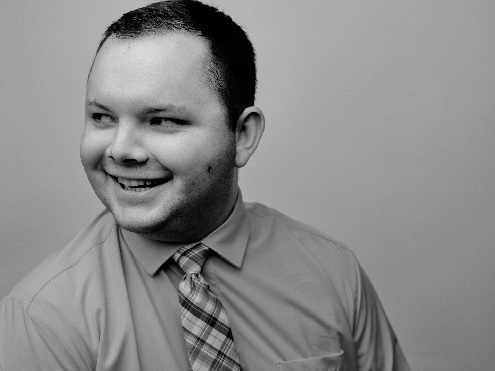

<body style="background-color:MintCream;">

<h3 style="text-align:center;font-size:185%;">[Home](https://pbischoff3.github.io/)  |  [Conferences](https://pbischoff3.github.io/Conferences) | [R Projects](https://pbischoff3.github.io/Projects)   |   [Publications](https://pbischoff3.github.io/Publications)  |  [Medical Hours](https://pbischoff3.github.io/Hours)</h3>

<h4 style="text-align:center;font-size:150%;"> [Patient Interaction](https://pbischoff3.github.io/Hours/patient)  |  [Leadership](https://pbischoff3.github.io/Hours/leadership)  |  [Service](https://pbischoff3.github.io/Hours/service)  |  [Research](https://pbischoff3.github.io/Hours/research)  |  [Shadowing](https://pbischoff3.github.io/Hours/shadowing) </h4>
 

Here you can find a list and description of my hours and opportunities I have pursued to become a better applicant for medical school. This is a working website, so look for updates periodically!
 

