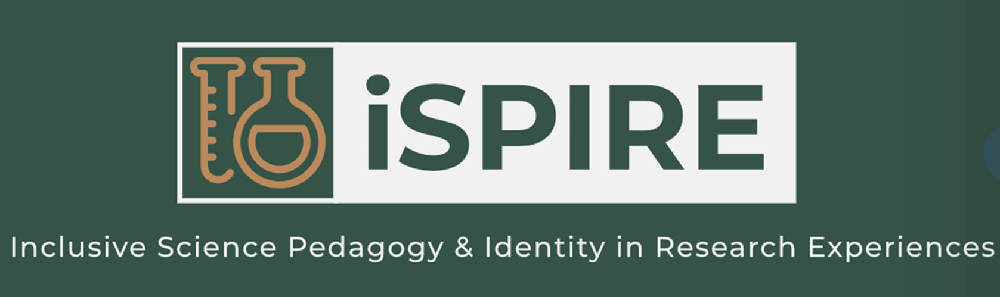
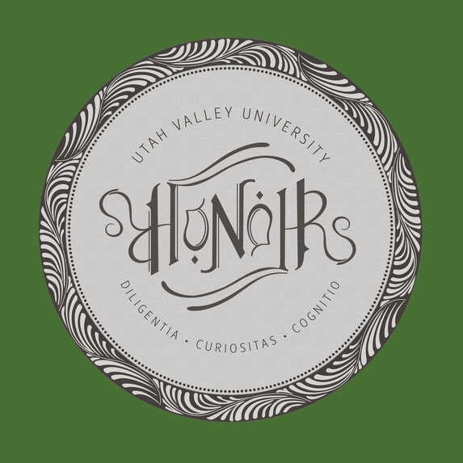

<body style="background-color:Gainsboro;">

<h3 style="background-color:DarkSeaGreen;text-align:center;font-size:175%;">[Home](https://pbischoff3.github.io/)   |   [Research]((https://pbischoff3.github.io/Research))   |   [Conferences](https://pbischoff3.github.io/Conferences) | [Projects](https://pbischoff3.github.io/Projects)   |   [Publications](https://pbischoff3.github.io/Projects)</h3>

## About Me
My name is Porter Bischoff. I am from Heber City, UT, and I am currently a undergraduate student at Utah Valley University. I am studying Biotechnology, and I hope to pursue an MD/PhD degree following my time here.   
While studying at UVU, I have been blessed with so many wonderful opportunities. As a biotech student, I was granted the [NSF S-STEM scholarship](https://www.uvu.edu/biology/s_stem_scholarship.html), allowing me to have a strong focus on research I am interested in as an undergraduate. I was involved with Station1 as a [Station1 Frontiers Fellow](https://www.station1.org/sff). This was a wonderful experience that included "an exciting research internship in emerging areas of science and technology with leading established and startup partner companies, research institutes, and nonprofit organizations, a cross-interdisciplinary shared curriculum, and personal and professional advancement activities including inclusive leadership and collaboration, scientific and technical communication, networking, and more." I worked with [GC Therapeutics](https://www.gc-tx.com/) as an intern following my time with Station1, and this provided me the unique experience of working with a biotech startup on the cutting edge of curing incurable diseases through stem cell implantation. Currently, I am an intern at Utah Valley University with Provost Wayne Vaught, as his [Presidential Intern](https://www.uvu.edu/president/interns/index.html). I am excited for the opportunities and experience that this position will hold.   
I am the oldest of 5, and I love my family so much. They are truly my best friends. I have a dog named Bubba that enjoys doing homework with me, and I love watching basketball. Sadly, I am a disappointed Utah Jazz fan. 

## Important Links 

### [LinkedIn](www.linkedin.com/in/porter-bischoff)
 
Here is my LinkedIn page.

### [iSPIRE Research](https://sites.google.com/uvu.edu/ispire/home)
 

 
I am involved in the iSPIRE Research Group at Utah Valley University. I am working with Drs. Josh Premo and Britt Wyatt, and the research group is studying science education as a whole. My particular project deals with STEM motivation, particularly dealing with medical conditions' influence on STEM motivation. 
 

### [Wolverine Story](https://www.uvu.edu/news/wolverine-stories/2022/03/2022_03_16_wolverine_stories_porter_bischoff.html)

  

In 2022, I was blessed with the opportunity to share my story with those of my cohorts at Utah Valley University in hopes that it can help inspire other students who have similar backgrounds as me in their path to success. 
 

### [Honor's Ambassador](https://www.uvu.edu/honors/new.ambassadors.html)

  
I have been part of the Honor's Program at UVU since I first began attending this school, and I am grateful to help other students be successful as they work their way through the honor's program.