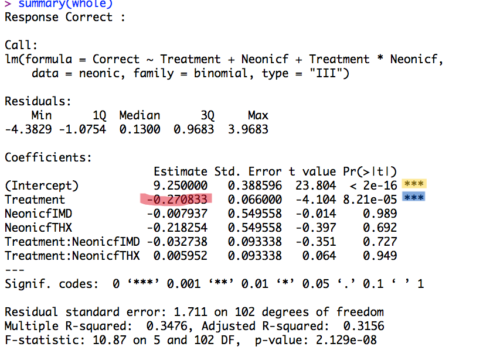

<h3 style="background-color:bisque;text-align:center;font-size:150%;">[Home](https://pbischoff3.github.io/) | [Data Overview](https://pbischoff3.github.io/data_overview/) | [Multi-Dimensional Analysis](https://pbischoff3.github.io/multi_dimensional_analysis/) | [Models](https://pbischoff3.github.io/models/) | [Conclusion](https://pbischoff3.github.io/Conclusion/)</h3>

<h4 style="background-color:bisque;text-align:center;font-size:73%;">[Science Identity](https://pbischoff3.github.io/models/si/) | [Career Motivation](https://pbischoff3.github.io/models/cm/) | [Intrinsic Motivation](https://pbischoff3.github.io/models/im/) | [Self-Determination](https://pbischoff3.github.io/models/sd/) | [Self-Efficacy](https://pbischoff3.github.io/models/se/) | [Grade Motivation](https://pbischoff3.github.io/models/gm)      | [Personal Communal Orientation](https://pbischoff3.github.io/models/per_com_orient/) | [Analysis](https://pbischoff3.github.io/models/analysis/)</h4>

## Explanation
We are now going to run models to analyze the data. Essentially, our goal here is to see if specific demographic information will cause a significant change in averages for the types of questions.  

When we run a generalized linear model, we choose the variable we want to measure (demographic) according to the average for the type of question asked. We are using Majors, Career Goals, Ethnicity, and Medical Conditions as variables we will control. These were selected after our multi-dimensional analysis showed that the other demographic information may not be significantly different. This does not mean that we throw the data out, but this is more of a subset of data that we are exploring now. Total data analysis is being ran in our research groups' experiment.  

When we run the generalized linear model, we are given an output looking like this:  

 

The very important aspects of this image are highlighted. The yellow highlight shows the "home base" that we refer back to. This is often the first aspect of variable in alphabetical order, and this is what we compare everything back to. The red highlight shows the difference in that variable from the "home base" variable. The blue highlight shows whether or not the difference highlighted in red is significant or not. With this basis, we are ready to run some of this model analysis. 

## Disclaimer
We are not running analysis on all data, as we are incorporating results from our MDS into this generalized linear model analysis. This is giving me the opportunity to learn how to analyze data in a different way. Normally, all of the data would be run regardless of the perceived significance.   

<h3 style="text-align:right;font-size:180%;">[**NEXT**](https://pbischoff3.github.io/models/si/)