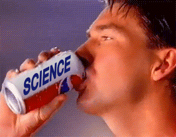

<h3 style="background-color:bisque;text-align:center;font-size:150%;">[Home](https://pbischoff3.github.io/) | [Data Overview](https://pbischoff3.github.io/data_overview/) | [Multi-Dimensional Analysis](https://pbischoff3.github.io/multi_dimensional_analysis/) | [Models](https://pbischoff3.github.io/models/) | [Conclusion](https://pbischoff3.github.io/Conclusion/)</h3>

<h4 style="background-color:bisque;text-align:center;font-size:73%;">[Science Identity](https://pbischoff3.github.io/models/si/) | [Career Motivation](https://pbischoff3.github.io/models/cm/) | [Intrinsic Motivation](https://pbischoff3.github.io/models/im/) | [Self-Determination](https://pbischoff3.github.io/models/sd/) | [Self-Efficacy](https://pbischoff3.github.io/models/se/) | [Grade Motivation](https://pbischoff3.github.io/models/gm)      | [Personal Communal Orientation](https://pbischoff3.github.io/models/per_com_orient/) | [Analysis](https://pbischoff3.github.io/models/analysis/)</h4>


```{r background, message=FALSE, warning=FALSE, include=FALSE}
source(file = "./R/Code/01-cleaning_data.R")
```

Let's check out Science Identity models. <br>

## Major
Let's see the influence that the difference in majors have an the average of Science Identity questions:
<br>
```{r echo=FALSE}
si_mod_1 <- glm(data = df,
                formula = science_id_ave ~ major)
summary(si_mod_1)
```
<br>
This shows that those who study Health Science, Non STEM, and Other majors have significantly lower Science Identity. <br>

This is great, but it is difficult to understand this in context until we compare it to the other models. 
<br>

## Career
Now, let's look at how career goals affect the average of Science Identity questions:
<br>
```{r echo=FALSE}
si_mod_2 <- glm(data = df,
                formula = science_id_ave ~ career)
summary(si_mod_2)
```
<br>
This shows that Medical Doctors, Researchers, and Scientists have significantly higher Science Identity. <br>

Now let's run from another model's point of view. <br>

## Ethnicity
How about we look at how different ethnicities affect Science Identity? <br>

```{r echo=FALSE}
si_mod_3 <- glm(data = df,
                formula = science_id_ave ~ ethnicity)
summary(si_mod_3)
```
<br>
This shows that American Indians and Caucasians are significantly lower in Science Identity. <br>

One last model. Let's check it out. 

## Medical Conditions
Here is the model according to a presence of medical conditions or not. <br>
```{r echo=FALSE}
si_mod_4 <- glm(data = df,
                formula = science_id_ave ~ med_condition)
summary(si_mod_4)
```
<br>

This shows that medical conditions do not affect Science Identity.

## Conclusion
Now that we have those 4 models according to the demographic that we are interested in, let's compare them against each other to see which models were best in determining Science Identity. <br>

```{r echo=FALSE}
compare_models(si_mod_1,si_mod_2,si_mod_3,si_mod_4, style = "se_p") 

```
<br> 
This shows everything that we have performed thus far, but now let's add some statistical analysis to it.
<br>
```{r echo=FALSE}
compare_performance(si_mod_1,si_mod_2,si_mod_3,si_mod_4) 

```
<br>
To put all of this in English, we are most interested in those that have higher R^2 values and lower BIC, AIC, and RMSE values. According to that knowledge, it looks like Majors and Careers are the best predictor for Science Identity. Let's see these together, and with that, we can see whether how they relate. 
<br>

```{r echo=FALSE}
si_mod_5 <- glm(data=df,
                formula = science_id_ave ~ major + career)
summary(si_mod_5) 
compare_models(si_mod_5) %>% plot()
```

Well awesome, this gives us a great place that we can start in further data analysis in our project. <br><br>


<h3 style="text-align:right;font-size:180%;">[**NEXT**](https://pbischoff3.github.io/models/cm/)