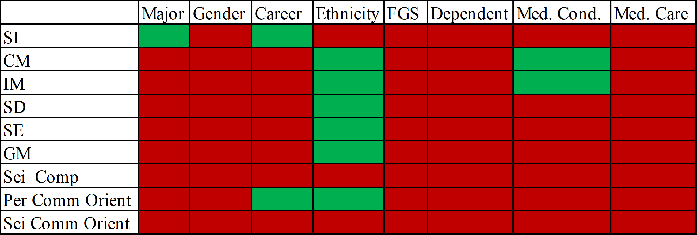

<h3 style="background-color:bisque;text-align:center;font-size:150%;">[Home](https://pbischoff3.github.io/) | [Data Overview](https://pbischoff3.github.io/data_overview/) | [Multi-Dimensional Analysis](https://pbischoff3.github.io/multi_dimensional_analysis/) | [Models](https://pbischoff3.github.io/models/) | [Conclusion](https://pbischoff3.github.io/Conclusion/)</h3>

<h4 style="background-color:bisque;text-align:center;font-size:95%;">[Major](https://pbischoff3.github.io/multi_dimensional_analysis/Major/) | [Gender](https://pbischoff3.github.io/multi_dimensional_analysis/Gender/) | [Career](https://pbischoff3.github.io/multi_dimensional_analysis/career/) | [Ethnicity](https://pbischoff3.github.io/multi_dimensional_analysis/Ethnicity/) | [First Generation Students](https://pbischoff3.github.io/multi_dimensional_analysis/fgs/) | [Dependents](https://pbischoff3.github.io/multi_dimensional_analysis/dependents/)      | [Medical Condition](https://pbischoff3.github.io/multi_dimensional_analysis/medical_condition/) | [Medical Care](https://pbischoff3.github.io/multi_dimensional_analysis/medical_care/) | [Analysis](https://pbischoff3.github.io/multi_dimensional_analysis/analysis/)</h4>

Man, this has been a party so far. I hope that you have enjoyed it thus far.  

To recap, let's first pull in the summary of all the significance factors according to both the questions and the type of demographic:  

  

To put all this in English, it looks like differences in Gender, Parent's Graduating College, Number of Dependents, and Caring for one with Medical Conditions are not significantly different. This **does not** mean that we should just throw out the data; instead, this allows us to start with a couple of models. As this is an opportunity to analyze the data in a different way than we typically would, we are going to create models based on this multi-dimensional analysis, excluding the demographics that did not answer questions significantly different. This is exciting stuff. You'd better be ready. 

 

<h3 style="text-align:right;font-size:180%;">[**NEXT**](https://pbischoff3.github.io/models/)