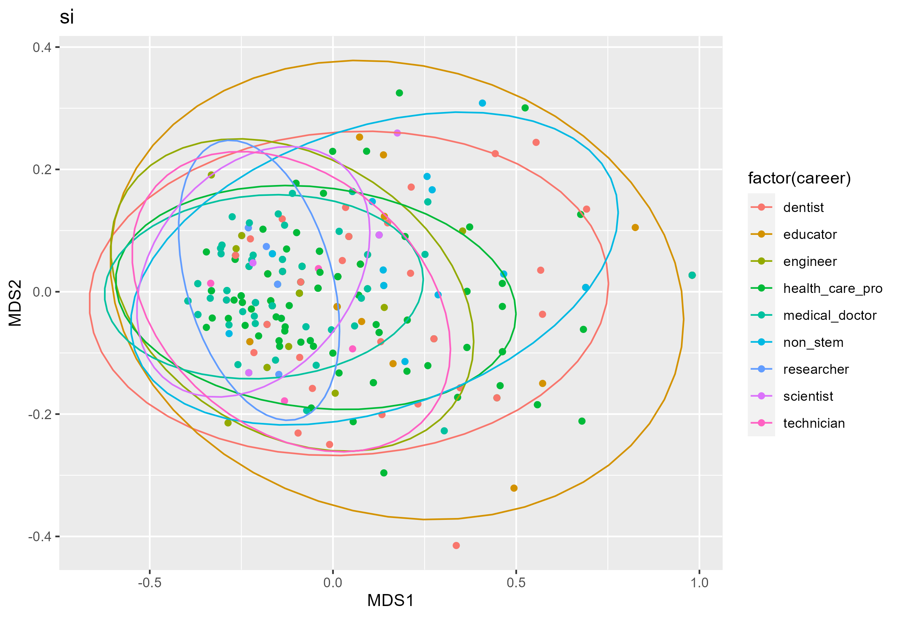
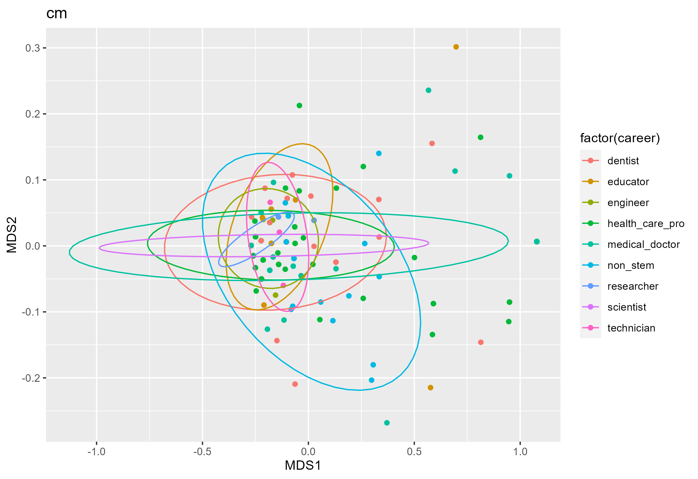
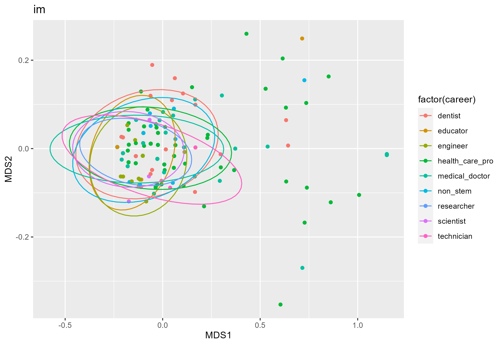
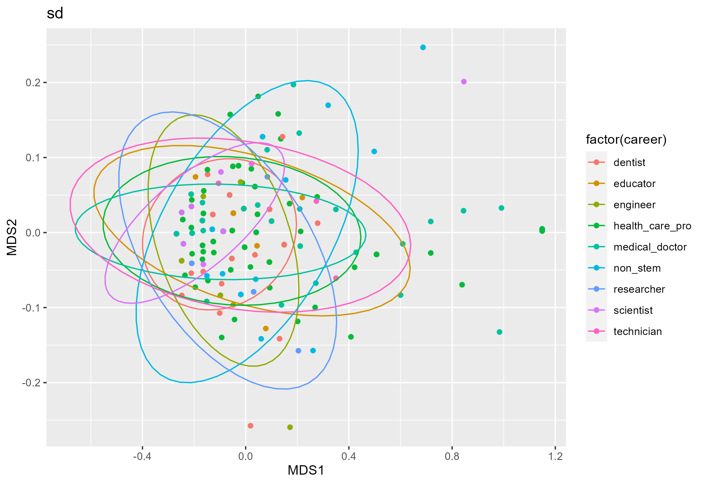
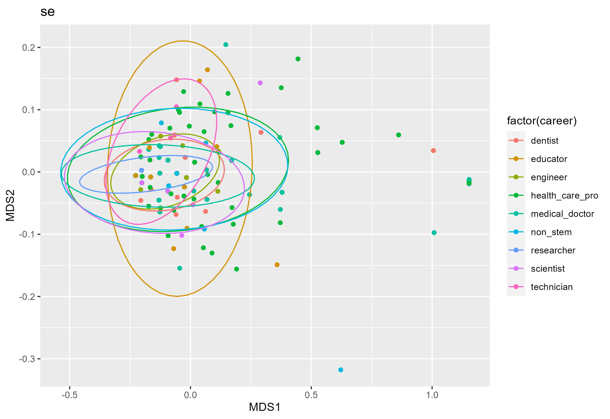
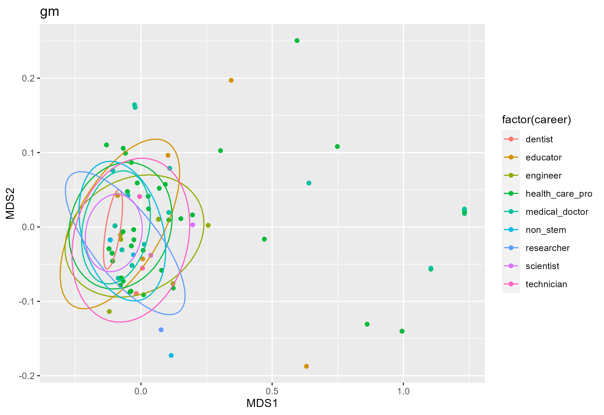
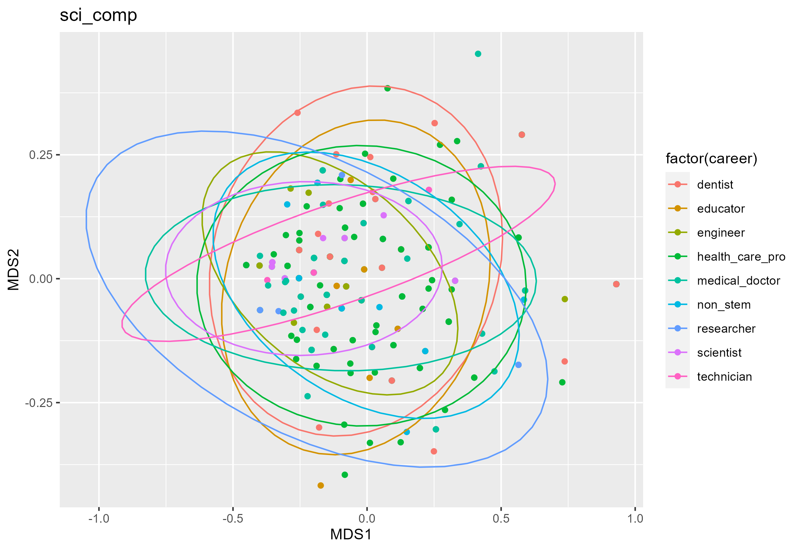
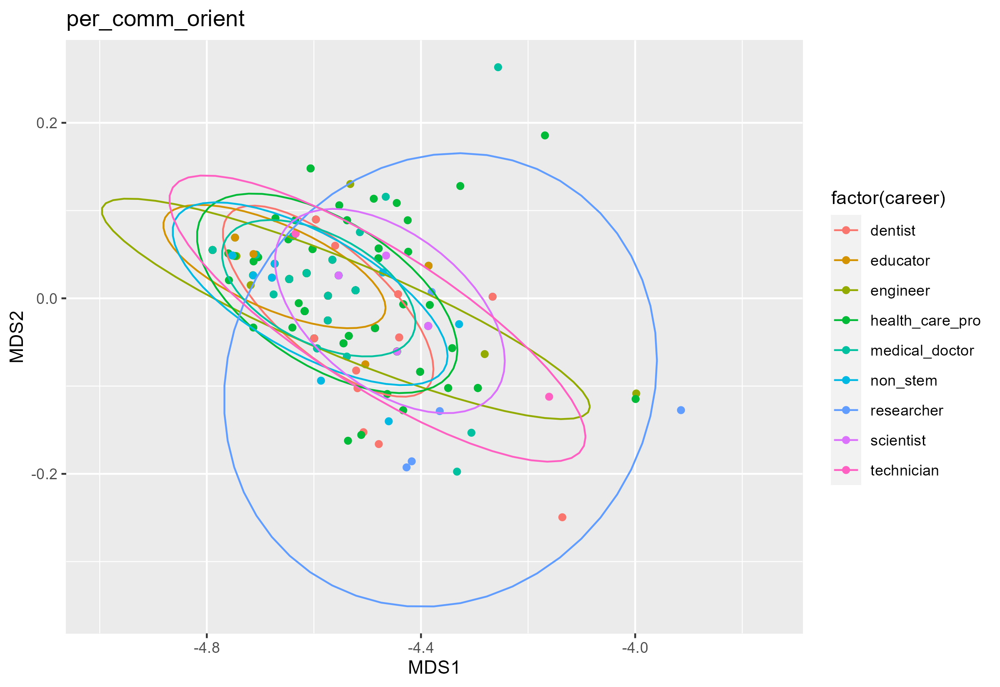
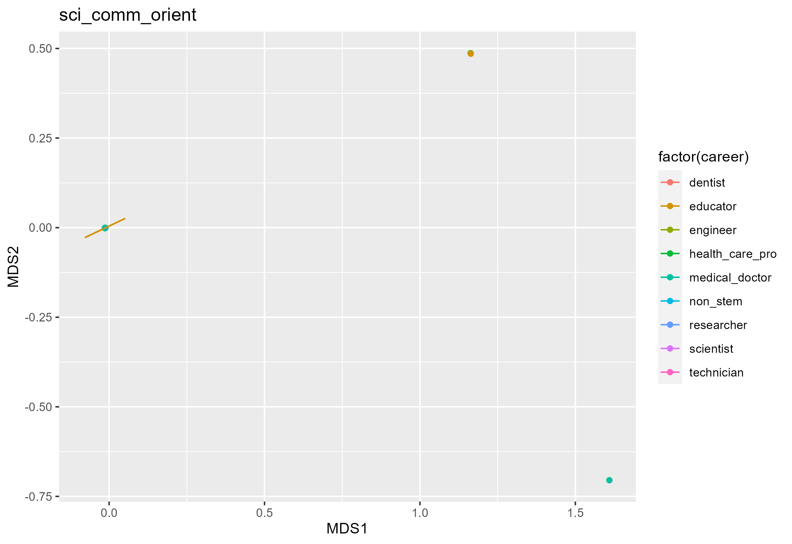
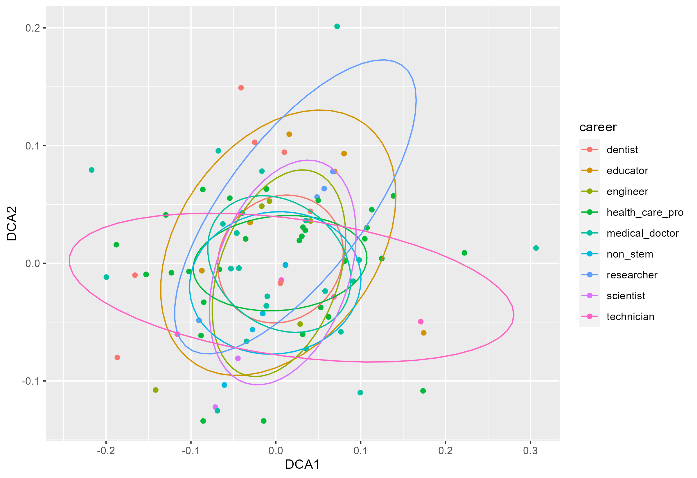

<h3 style="background-color:bisque;text-align:center;font-size:165%;">[Home](https://pbischoff3.github.io/) | [Data Overview](https://pbischoff3.github.io/data_overview/) | [Multi-Dimensional Analysis](https://pbischoff3.github.io/multi_dimensional_analysis/) | [Conclusion](https://pbischoff3.github.io/Conclusion/)</h3>

<h4 style="background-color:bisque;text-align:center;font-size:95%;">[Major](https://pbischoff3.github.io/multi_dimensional_analysis/Major/) | [Gender](https://pbischoff3.github.io/multi_dimensional_analysis/Gender/) | [Career](https://pbischoff3.github.io/multi_dimensional_analysis/career/) | [Ethnicity](https://pbischoff3.github.io/multi_dimensional_analysis/Ethnicity/) | [First Generation Students](https://pbischoff3.github.io/multi_dimensional_analysis/fgs/) | [Dependents](https://pbischoff3.github.io/multi_dimensional_analysis/dependents/)      | [Medical Condition](https://pbischoff3.github.io/multi_dimensional_analysis/medical_condition/) | [Medical Care](https://pbischoff3.github.io/multi_dimensional_analysis/medical_care/) | [Analysis](https://pbischoff3.github.io/multi_dimensional_analysis/analysis/)</h4>
  
```{r background, message=FALSE, warning=FALSE, include=FALSE}
source(file = "./R/Code/01-cleaning_data.R")
```


## Function
To begin, let's explore the function we created to run all of this statistical analysis:
```{r message=FALSE, warning=FALSE}
mysubsetMDS <- function(x){
  mysubset <- df %>% 
    select(starts_with(x))
  
  meta <- metaMDS(mysubset)
  MDS_df <- data.frame(MDS1=meta$points[,1],MDS2=meta$points[,2]) %>%
    cbind(demo)
  return(MDS_df)
}
```
<br>
In English, this function allows us to run the MDS according to each subset of demographic and each subset of question type that we want. Obviously, in this page, we are exploring Career Goals.

## Question Types
### Science Identity
Let's explore the science identity subset of questions first. Running our function we created and plotting it, we are left with this image of the plot:<br>

<br> This is great and all, but let's run an adonis test to see if there is a significant difference in how different career goals responded to science identity questions:
```{r echo=FALSE, message=FALSE, warning=FALSE}
set.seed(123)
adonis(si ~ demo$career)
```
Look at that! The differences are significant for Science Identity across career goals. <br>


<br>

### Career Motivation
Next, let's look into Carer Motivation: <br>

<br>
And an Adonis test:
```{r echo=FALSE, message=FALSE, warning=FALSE}
set.seed(123)
adonis(cm ~ demo$career)
```
This shows that the differences in answers are not significant, according to career goals. <br>


<br>

### Intrinsic Motivation
Now, Intrinsic Motivation: <br>

<br>
And an Adonis test:
```{r echo=FALSE, message=FALSE, warning=FALSE}
set.seed(123)
adonis(im ~ demo$career)
```
This shows that the differences in answers are not significant, according to career goals. <br>


### Self-Determination
Now, Self-Determination: <br>

<br>
And an Adonis test:
```{r echo=FALSE, message=FALSE, warning=FALSE}
set.seed(123)
adonis(sd ~ demo$career)
```
This shows that the differences in answers are not significant, according to career goals. <br>


### Self-Efficacy
Now, Self-Efficacy: <br>

<br>
And an Adonis test:
```{r echo=FALSE, message=FALSE, warning=FALSE}
set.seed(123)
adonis(se ~ demo$career)
```
This shows that the differences in answers are not significant, according to career goals. <br>


### Grade Motivation
Now, Grade Motivation: <br>

<br>
And an Adonis test:
```{r echo=FALSE, message=FALSE, warning=FALSE}
set.seed(123)
adonis(gm ~ demo$career)
```
This shows that the differences in answers are not significant, according to career goals. <br>


### Competency in Science
Now, Competency in Science: <br>

<br>
And an Adonis test:
```{r echo=FALSE, message=FALSE, warning=FALSE}
set.seed(123)
adonis(sci_comp ~ demo$career)
```
This shows that the differences in answers are not significant, according to career goals. <br>


### Personal Community Orientation
Now, Personal Community Orientation: <br>

<br>
And an Adonis test:
```{r echo=FALSE, message=FALSE, warning=FALSE}
set.seed(123)
adonis(per_comm_orient ~ demo$career)
```
Look at that! The differences are significant for Science Identity across career goals. <br>


### Science Community Orientation
Now, Competency in Science: <br>

<br> Well crap, something is broke there. Let's try running a different form of MDS, giving us a similar analysis in a different way. We can interpret this data similarly to how we did before:
<br> 

<br>
And an Adonis test:
```{r echo=FALSE, message=FALSE, warning=FALSE}
set.seed(123)
adonis(sci_comm_orient ~ demo$career)
```
This shows that the differences in answers are not significant, according to major. <br>


## Conclusion
Ultimately, what we can understand from all of this is that students significantly answer Science Identity and Personal Communal Orientation questions differently according to their career goals.


<h3 style="text-align:right;font-size:180%;">[**NEXT**](https://pbischoff3.github.io/multi_dimensional_analysis/Ethnicity/)