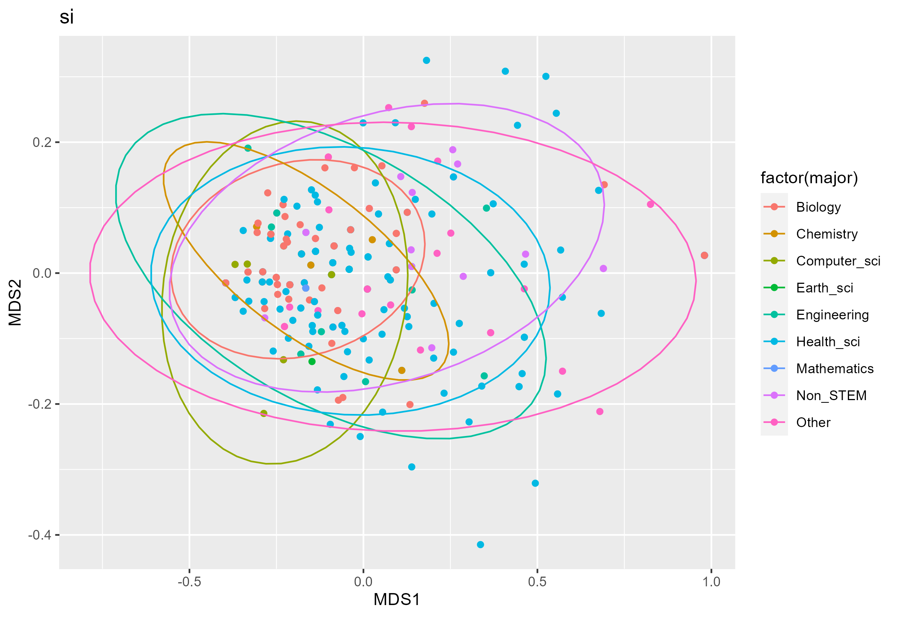

<h3 style="background-color:bisque;text-align:center;font-size:165%;">[Home](https://pbischoff3.github.io/) | [Data Overview](https://pbischoff3.github.io/data_overview/) | [Multi-Dimensional Analysis](https://pbischoff3.github.io/mutli_dimensional_analysis/) | [Conclusion](https://pbischoff3.github.io/Conclusion/)</h3>

<h4 style="background-color:bisque;text-align:center;font-size:102%;">[Major](https://pbischoff3.github.io/mutli_dimensional_analysis/Major/) | [Gender](https://pbischoff3.github.io/mutli_dimensional_analysis/Gender/) | [Career](https://pbischoff3.github.io/mutli_dimensional_analysis/career/) | [Ethnicity](https://pbischoff3.github.io/mutli_dimensional_analysis/Ethnicity/) | [First Generation Students](https://pbischoff3.github.io/mutli_dimensional_analysis/fgs/) | [Dependents](https://pbischoff3.github.io/mutli_dimensional_analysis/dependents/)      | [Medical Condition](https://pbischoff3.github.io/mutli_dimensional_analysis/medical_condition/) | [Medical Care](https://pbischoff3.github.io/mutli_dimensional_analysis/medical_care/)</h4>
  
```{r background, message=FALSE, warning=FALSE, include=FALSE}
source(file = "./R/Code/01-cleaning_data.R")
```


## Function
To begin, let's explore the function we created to run all of this statistical analysis:
```{r message=FALSE, warning=FALSE}
mysubsetMDS <- function(x){
  mysubset <- df %>% 
    select(starts_with(x))
  
  meta <- metaMDS(mysubset)
  MDS_df <- data.frame(MDS1=meta$points[,1],MDS2=meta$points[,2]) %>%
    cbind(demo)
  return(MDS_df)
}
```
<br>
In English, this function allows us to run the MDS according to each subset of demographic and each subset of question type that we want. Obviously, in this page, we are exploring Majors.

## Science Identity
Let's explore the science identity subset of questions first. Running our function we created and plotting it, we are left with this image of the plot:

This is great and all, but let's run an adonis test to see if there is a significant difference in how different majors responded to science identity questions:
```{r message=FALSE, warning=FALSE}
adonis(si ~ demo$major)
```


